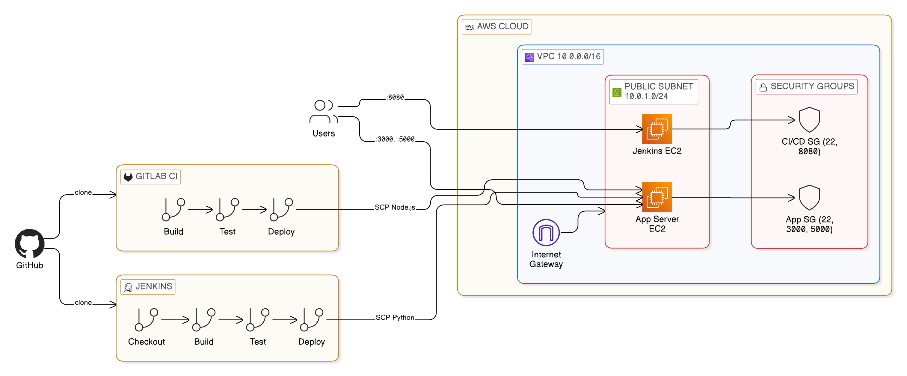

# CI/CD Pipeline Comparison: Jenkins vs GitLab CI

A side-by-side implementation of two industry-standard CI/CD platforms deploying applications to shared infrastructure, demonstrating how pipeline tools differ in configuration, execution, and deployment patterns.

## Overview

Organisations evaluating CI/CD tooling need to understand the practical differences between platforms—not just feature lists, but how pipelines are actually written and executed. This project implements identical deployment workflows in both Jenkins and GitLab CI, targeting the same application server to enable direct comparison.

The infrastructure consists of a Jenkins server and a shared application server, both provisioned with Terraform in a custom VPC. Jenkins deploys a Python Flask application via SSH/SCP using a declarative Jenkinsfile, while GitLab CI deploys a Node.js Express application using containerised pipeline stages with Docker-based runners. Both pipelines follow the same build → test → deploy pattern but demonstrate platform-specific approaches to secrets management, agent configuration, and deployment execution.

This architecture mirrors real-world scenarios where teams run multiple CI/CD tools during migrations or use different platforms for different application types.

## Architecture

The system runs on AWS with two EC2 instances in a public subnet:

- **Jenkins Server** (port 8080): Hosts the Jenkins controller, pulls from GitHub, and executes pipeline stages directly on the instance. Deploys via SSH to the application server.
- **Application Server** (ports 3000, 5000): Receives deployments from both pipelines. Runs the Flask app on port 5000 and the Node.js app on port 3000.

GitLab CI runs externally on GitLab.com, using Docker containers for each pipeline stage. The deploy stage installs an SSH agent, injects credentials from GitLab CI/CD variables, and deploys to the same application server.

Security groups enforce network boundaries: the Jenkins server only exposes SSH and port 8080, while the application server exposes SSH and the two application ports.

## Tech Stack

**Infrastructure**: AWS EC2, VPC, Terraform  
**CI/CD**: Jenkins (Declarative Pipeline), GitLab CI  
**Applications**: Python Flask, Node.js Express  
**Deployment**: SSH, SCP, nohup process management

## Key Decisions

- **Shared application server for both pipelines**: Demonstrates that different CI/CD tools can target the same infrastructure, which is common during platform migrations or in polyglot environments.

- **Declarative Jenkinsfile over scripted pipeline**: The declarative syntax provides clearer stage definitions and is the recommended approach for new Jenkins implementations, making the pipeline more maintainable.

- **SSH-based deployment over containerised deployment**: Both pipelines use SCP and SSH for deployment rather than container orchestration, reflecting common patterns in organisations that haven't yet adopted Kubernetes.

- **Terraform-managed infrastructure**: All AWS resources are codified, enabling reproducible environments and demonstrating infrastructure-as-code practices alongside CI/CD implementation.

## Screenshots

## Author

**Noah Frost**

- Website: [noahfrost.co.uk](https://noahfrost.co.uk)
- GitHub: [github.com/nfroze](https://github.com/nfroze)
- LinkedIn: [linkedin.com/in/nfroze](https://linkedin.com/in/nfroze)