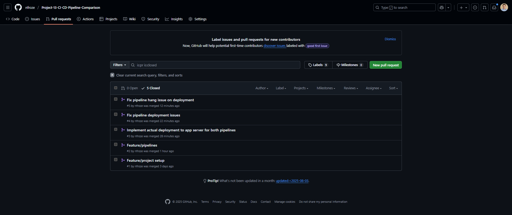

# CI CD Pipeline Comparison

A side-by-side comparison of Jenkins and GitLab CI deploying real applications to the same AWS infrastructure, demonstrating how different CI/CD tools solve the same problem with different trade-offs.

## Overview

Most teams inherit their CI/CD tooling rather than choosing it deliberately. This project runs Jenkins and GitLab CI in parallel against the same AWS environment to compare their approaches to building, testing, and deploying applications. Jenkins deploys a Python Flask app while GitLab CI deploys a Node.js Express app — both targeting the same EC2 application server via SSH.

The entire infrastructure is provisioned with Terraform: a VPC with a public subnet, two EC2 instances (one for Jenkins, one as the shared application server), and security groups scoped to each role. This mirrors a real scenario where a team evaluates CI/CD platforms before committing to one, using identical infrastructure to ensure a fair comparison.

## Architecture

GitHub hosts the source repository. Jenkins runs on a dedicated EC2 instance, pulls code via git checkout, and deploys the Python app to the application server over SSH using SCP. GitLab CI runs on GitLab's SaaS runners, builds the Node.js app, and deploys to the same application server using the same SSH/SCP mechanism.

Both pipelines follow the same pattern — build, test, deploy — but Jenkins requires its own server to manage while GitLab CI runs externally with no infrastructure to maintain. The application server exposes both apps on separate ports (3000 for Node.js, 5000 for Python), with security groups restricting access appropriately.

## Tech Stack

**Infrastructure**: AWS VPC, EC2 (t2.micro), Internet Gateway, Security Groups, Terraform

**CI/CD**: Jenkins (self-hosted on EC2), GitLab CI (SaaS runners)

**Application**: Node.js/Express (port 3000), Python/Flask (port 5000)

**Deployment**: SSH/SCP to EC2

## Key Decisions

- **Two different applications instead of one**: Deploying a Node.js app via GitLab and a Python app via Jenkins avoids artificial duplication and shows each tool handling a realistic, distinct workload.

- **Self-hosted Jenkins vs. SaaS GitLab CI**: This is the core comparison — Jenkins requires provisioning and maintaining an EC2 instance, while GitLab CI uses managed runners. The infrastructure cost and operational overhead difference is immediately visible in the Terraform config.

- **Shared application server**: Both pipelines deploy to the same EC2 instance rather than separate targets. This isolates the comparison to the CI/CD layer and keeps infrastructure costs minimal.

- **SSH/SCP deployment over containers**: Using direct SSH deployment keeps the focus on comparing the pipelines themselves rather than introducing container orchestration complexity.

## Screenshots

**AWS EC2 Instances Dashboard** — The AWS console displaying both EC2 instances provisioned by Terraform: the Jenkins server instance and the shared application server. Security groups and instance details are visible, showing the infrastructure setup that both CI/CD pipelines target for deployment.

**GitHub Repository Pull Request** — A detailed pull request view on GitHub showing the commit history and build logs from a pipeline run. The PR displays multiple commits with detailed output from build stages, demonstrating the version control integration that triggers both Jenkins and GitLab CI pipelines.

**GitLab CI Pipeline Dashboard** — A GitLab merge request displaying the pipeline status with build stages visualized. The interface shows job stages (build, test, deploy) for the Node.js Express application, illustrating how GitLab CI orchestrates the deployment process on SaaS runners without requiring self-managed infrastructure.

**Jenkins Pipeline Stages** — The Jenkins UI displaying a completed pipeline job with detailed stage visualization. Multiple build steps are shown including checkout, build, test, and deployment stages for the Python Flask application, with logs revealing each step's execution and output.

**Node.js Application Running on Port 3000** — The deployed Node.js Express application accessed at `18.134.245.3:3000` with the header "Node App - Deployed by GitLab". This demonstrates successful deployment via GitLab CI to the shared EC2 application server, with the application running and responding to requests on the designated port.

**Python Flask Application Running on Port 5000** — The deployed Python Flask application accessed at `18.134.245.3:5000` with the header "Python App - Deployed by Jenkins". This demonstrates successful deployment via Jenkins to the same EC2 application server, proving both CI/CD tools can deploy different application stacks to shared infrastructure using the same SSH/SCP mechanism.

## Author

**Noah Frost**

- Website: [noahfrost.co.uk](https://noahfrost.co.uk)
- GitHub: [github.com/nfroze](https://github.com/nfroze)
- LinkedIn: [linkedin.com/in/nfroze](https://linkedin.com/in/nfroze)